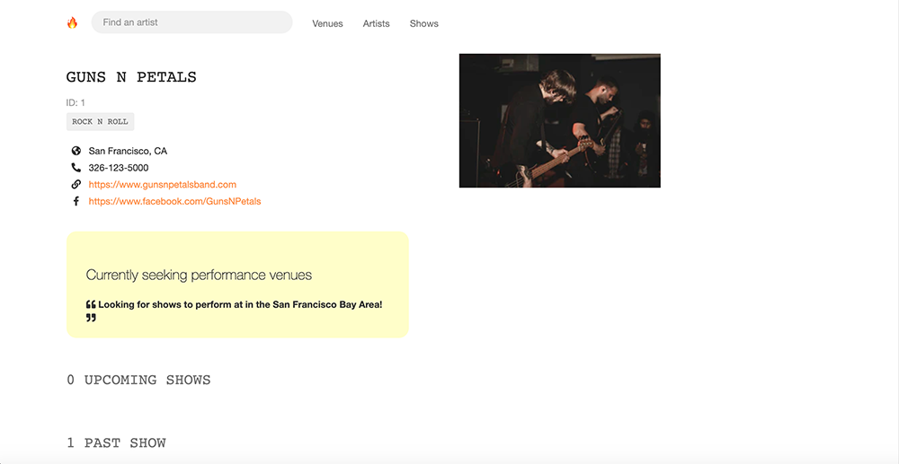
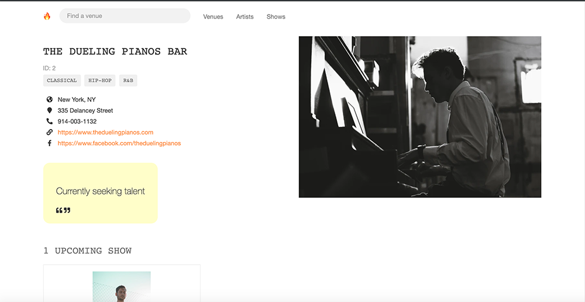
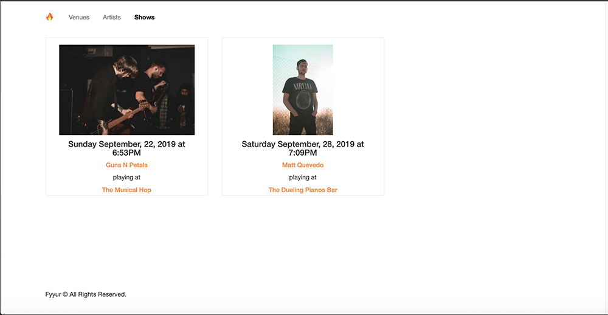

Fyyur:Artist Booking Site
-----

### Overview

Fyyur is a musical venue and artist booking site that facilitates the discovery and bookings of shows between local performing artists and venues. This site lets you list new artists and venues, discover them, and list shows with artists as a venue owner:
  - creating new venues, artists, and creating new shows.
  - searching for venues and artists.
  - learning more about a specific artist or venue.

### Images of the site
  
  
  
  
### Tech Stack

Our tech stack will include:

* **SQLAlchemy ORM** to be our ORM library of choice
* **PostgreSQL** as our database of choice
* **Python3** and **Flask** as our server language and server framework
* **Flask-Migrate** for creating and running schema migrations
* **HTML**, **CSS**, and **Javascript** with [Bootstrap 3](https://getbootstrap.com/docs/3.4/customize/) for our website's frontend

### Main Files: Project Structure

  ```sh
  ├── README.md
  ├── app.py *** the main driver of the app. Includes your SQLAlchemy models.
                    "python app.py" to run after installing dependences
  ├── config.py *** Database URLs, CSRF generation, etc
  ├── error.log
  ├── forms.py *** Your forms
  ├── requirements.txt *** The dependencies we need to install with "pip3 install -r requirements.txt"
  ├── static
  │   ├── css 
  │   ├── font
  │   ├── ico
  │   ├── img
  │   └── js
  └── templates
      ├── errors
      ├── forms
      ├── layouts
      └── pages
  ```

Overall:
* Models are located in the `MODELS` section of `app.py`.
* Controllers are also located in `app.py`.
* The web frontend is located in `templates/`, which builds static assets deployed to the web server at `static/`.
* Web forms for creating data are located in `form.py`

### Getting Started :
  - Clone this repository.
  - Clone this repo: git clone git@github.com:Aboeleneen/Fyyur-Artist-Booking-Site.git
  - Change to the repo directory: cd Fyyur
  - If you want to use virtualenv: virtualenv ENV && source ENV/bin/activate
  - Install dependencies with pip: pip install -r requirements.txt
  - Connect your local database
      - in app.py app.config['SQLALCHEMY_DATABASE_URI'] = '<your database>'
      - in config.py SQLALCHEMY_DATABASE_URI = '<your database>'
  - Run the development server:
      - $export FLASK_APP=myapp
      - $ export FLASK_ENV=development # enables debug mode
      - $ python3 app.py

  - Navigate to Home page http://localhost:5000

